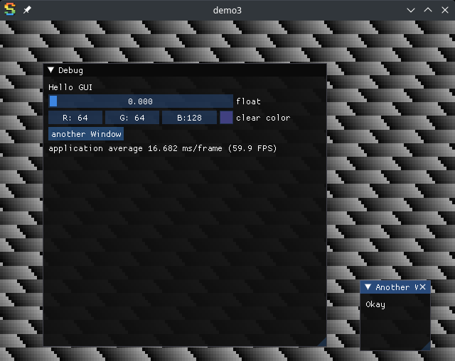

# Game Dev experiments [](https://github.com/OrangeTide/gamedev/actions)

Collection of my studies in game development.

## Description

Uses [Sokol](https://github.com/floooh/sokol) to implement some prototype games.

## Getting Started

### Desktop

#### Dependencies

  * Linux or Windows
  * GCC or MSYS2/MinGW-w64
  * cmake 2.8 or newer
  * GNU Make (optional)

##### Ubuntu 22.04

```sh
sudo apt-get install -y build-essential git cmake
sudo apt-get install -y libx11-dev libxext-dev libxfixes-dev libxi-dev \
    libxcursor-dev libgl1-mesa-dev libglfw3-dev libasound2-dev
```

#### Building

  * Run `make`

### Executing the Program

  * Run `bin/demo3` or any of the other studies in bin.



### Android

#### Dependencies

  * Android Studio 2021.3.1 Patch 1 or later.
  * Android SDK 33

#### Building

From Android Studio:

  * Navigate to "File" then "Open..."
  * select directory `android/`

From command-line:

  * Run `./gradlew assembleDebug`

#### Executing

From Android Studio:

  * Setup an emulator in "Device Manager"
    * Android 11.0 Pixel 4 API 30 for 32-bit x86 is a reasonable choice
  * Click the the run arrow

(TODO: describe how to do this from command-line)

## Help

Create a new issue at https://github.com/OrangeTide/gamedev/issues

## License

This project is licensed under the [0BSD License](LICENSE)

## Acknowledgments

  * [sokol](https://github.com/floooh/sokol)
  * [sokol-samples](https://github.com/floooh/sokol-samples)
  * [Dear ImGui](https://github.com/ocornut/imgui)
  * [cimgui](https://github.com/cimgui/cimgui)
  * [bq_websocket](https://github.com/bqqbarbhg/bq_websocket)
  * [native-activity example](https://github.com/android/ndk-samples/tree/main/native-activity)
  * [stb](https://github.com/nothings/stb)
