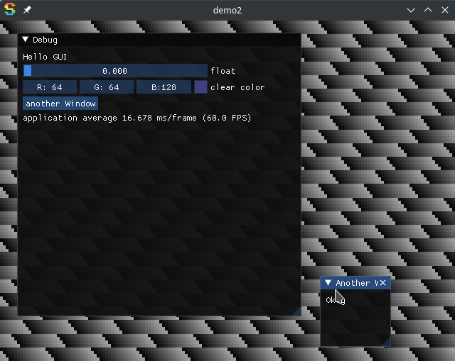

# Game Dev experiments [](https://github.com/OrangeTide/gamedev/actions)

Collection of my studies in game development.

## Description

Uses [Sokol](https://github.com/floooh/sokol) to implement some prototype games.

## Getting Started

### Dependencies

* Linux or Windows
* GCC or MSYS2/MinGW-w64
* cmake 2.8 or newer
* GNU Make (optional)

#### Ubuntu 22.04

```sh
sudo apt-get install -y build-essential git cmake
sudo apt-get install -y libx11-dev libxext-dev libxfixes-dev libxi-dev \
    libxcursor-dev libgl1-mesa-dev libglfw3-dev libasound2-dev
```

### Building

* Run `make`

### Executing program

* Run `bin/demo3` or any of the other studies in bin.



## Help

Any advise for common problems or issues.
```
command to run if program contains helper info
```

## License

This project is licensed under the [0BSD License](LICENSE)

## Acknowledgments

Inspiration, code snippets, etc.
* [sokol](https://github.com/floooh/sokol)
* [sokol-samples](https://github.com/floooh/sokol-samples)
* [sokol-samples](https://github.com/floooh/sokol-samples)
* [Dear ImGui](https://github.com/ocornut/imgui)
* [cimgui](https://github.com/cimgui/cimgui)
* [bq_websocket](https://github.com/bqqbarbhg/bq_websocket)
